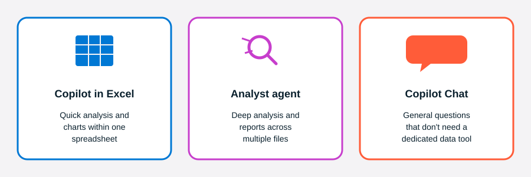
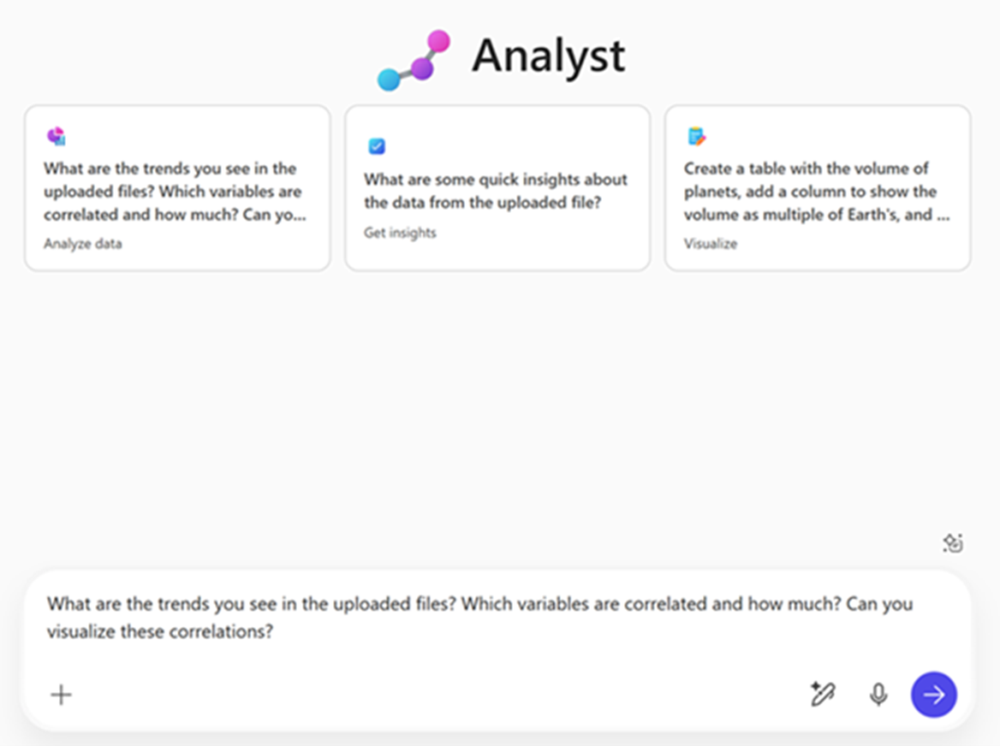

::: zone pivot="Video"

[!VIDEO https://learn-video.azurefd.net/vod/player?id=b29bfcb0-80f3-4cfb-b955-2bc4114c4473]

::: zone-end

::: zone pivot="Text"

You've already explored Copilot in Excel for in-spreadsheet analysis. But when your manager needs a polished, shareable report that goes deeper — comparing performance across regions and quarters, identifying top products, and highlighting areas for improvement — a different tool is better suited for the job.

## Choose the right tool for your task

Microsoft Copilot offers three experiences for data work, each suited to a different type of task.

| Task | Best tool |
|---|---|
| Explore, chart, or transform data within an existing Excel spreadsheet | Copilot in Excel |
| Deep analysis across multiple files with citations and a polished report | Analyst agent |
| General AI chat, web research, or quick summaries and drafts | Copilot Chat |

## What is the Analyst agent?

The Analyst agent is an AI-powered data analysis assistant built into Microsoft Copilot. You can access Analyst in the Microsoft Copilot app from the left navigation pane or from the **Agents** list in Copilot Chat.

It's designed to help you:

- Analyze data from files like Excel spreadsheets, CSVs, JSON files, PDFs, and Word documents.
- Apply chain-of-thought reasoning to identify trends, outliers, and key metrics across multiple files at once.
- Generate structured, shareable reports with charts, tables, and cited findings.
- Support tasks like comparing regional performance, forecasting trends, or summarizing customer feedback patterns.

Unlike standard Copilot Chat, which focuses on drafting and editing, the Analyst agent is purpose-built for data analysis, visualization, and insight generation.

## Working with the Analyst agent

You start by attaching the files you want to analyze — Excel, CSV, JSON, PDF, or Word documents — then describe what you need. The agent reads across all attached files, reasons through the data, and returns a structured report with charts, tables, and cited findings. You don't need to specify which sheet or column to look at; the agent figures that out from your prompt.

The more context you give in your prompt, the more focused the output. A prompt like this gives the agent a clear goal and scope:

- **Highlight key trends in sales performance by region and quarter from the attached file.**

Once you have an initial report, follow-up prompts let you drill into specific areas:

- **Identify the top-performing products based on revenue and units sold.**
- **Compare Q1 and Q2 sales performance by region and highlight any declines.**

You can also shape the output for your specific audience. The same analysis can be reformatted without re-running it:

- **Summarize these findings into three bullet points for a leadership slide.**
- **Write an executive summary for this report.**
- **Draft an email update summarizing these insights for the team.**

This iterative approach — attach, prompt, refine, reformat — is what makes the Analyst agent well suited to real-world reporting tasks where you often need to present the same data to different audiences.

With the Analyst agent, you transform complex data analysis into a streamlined process — without leaving your Microsoft 365 apps.
::: zone-end

> **NOTE**: We recognize that different people like to learn in different ways. You can choose to complete this module in video-based format or you can read the content as text and images. The text contains greater detail than the videos, so in some cases you might want to refer to it as supplemental material to the video presentation.
