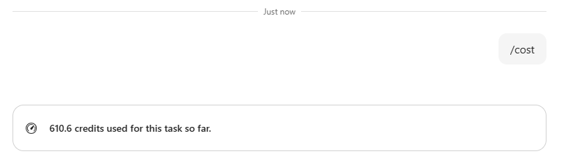

::: zone pivot="Video"
 
[!VIDEO https://learn-video.azurefd.net/vod/player?id=6eab6a59-865a-4ba8-98f1-e79f418c5308]
 
::: zone-end
 
::: zone pivot="Text"

Some Copilot experiences use a consumption model to measure the work they perform. Instead of providing unlimited usage through a fixed license, these experiences track the work completed on your behalf and apply usage based on that activity.

Understanding how usage accumulates helps you scope work effectively, choose the right approach for a task, and make informed decisions about how you use Copilot.

## How consumption-based Copilot works

When you submit a request, Copilot performs work to achieve the outcome. Depending on the experience, that work may contribute to your organization's usage.

Usage can accumulate as Copilot:

- Retrieves and processes information
- Reads files and other data sources
- Reasons across multiple inputs
- Generates responses and drafted content
- Calls tools and connected capabilities
- Creates images or other media
- Performs actions in apps or browsers

The amount of usage depends on the work required to complete the task.

For example, a simple question that references a single source generally requires less work than a task that gathers information from multiple locations, analyzes findings, creates content, and completes follow-up actions.

The goal isn't to minimize usage. The goal is to use Copilot intentionally so that the value of the outcome matches the work required to produce it.

## What affects how much a task uses

Several factors determine how much usage a task consumes. Knowing them helps you make intentional choices.

**Task scope and complexity.** The number of steps needed to achieve a goal is often one of the largest drivers of usage. For example, asking Copilot to summarize a document typically requires less work than asking it to analyze several documents, identify trends, and draft a recommendation report.

**Information processed.** The amount of information Copilot needs to analyze can significantly affect usage. Tasks that work with multiple files, messages, records, or data sources generally require more work than tasks focused on a single source.

**Tools and capabilities.** Many Copilot experiences can call tools, skills, or connected systems while completing a task. Searching the web, querying connected applications, generating images, or performing actions in other systems may increase the amount of work required to complete a request.

**Model selection.** Many consumption-based Copilot experiences let you choose the AI model powering a conversation. Models differ in how deeply they reason and how much work they perform per turn. A more capable model handles complex reasoning and nuanced tasks, but it also uses more per request. For many tasks, a lighter model reaches a good result just as well.

**Type of output generated.** Some outputs require more work than others. For example, generating images or other media often requires more processing than generating text alone.

## Work with usage in mind

Working efficiently doesn't mean asking Copilot for less. It means giving Copilot what it needs to produce a useful result without unnecessary rework.

- **Be clear and specific.** Clear requests reduce ambiguity and often lead to useful results with fewer revisions.
- **Describe the desired outcome.** Providing the overall goal helps Copilot understand what you're trying to accomplish and plan the work required to get there.
- **Provide the right context.** Including relevant files, details, or constraints can help Copilot produce better results without repeatedly gathering missing information.
- **Use advanced capabilities intentionally.** Features such as image generation, connected tools, and multi-step automation can deliver significant value when they're appropriate for the task.
- **Review usage information when available.** Some experiences provide visibility into usage. Reviewing this information can help you better understand how different tasks consume resources.

Remember: the objective is not to avoid usage. The objective is to achieve meaningful outcomes efficiently.

## Apply these concepts in Copilot Cowork

The principles you've learned apply across many consumption-based Copilot experiences. Copilot Cowork provides one example of how those principles are implemented.

Copilot Cowork uses usage-based billing. Usage is measured in Copilot Credits, which accumulate as Cowork performs work such as reading files, generating content, calling skills, creating images, and completing browser tasks.

### Usage limits

Your administrator configures the credit limit for your organization. If you reach that limit, you can request additional credits through Cowork. Your administrator reviews the request and determines whether to approve additional usage.

### Check task usage

Type **/cost** in a conversation to view the credits used by the current task.

For example, Cowork might display:

    610.6 credits used for this task so far.

Reviewing usage periodically can help you understand which types of tasks require relatively little work and which require more.

### Choose a model

Cowork supports multiple AI models.

For most work, leave the model selector set to Auto. Auto selects an appropriate model based on the nature of the task, helping balance capability and usage automatically.

More advanced models may provide additional reasoning capabilities for complex tasks, while simpler tasks might not require that level of capability.

To learn how the available models differ and when to change the selection, see [Choose a model for Copilot Cowork](/microsoft-365/copilot/cowork/cowork-models).

::: zone-end

> **NOTE**: We recognize that different people like to learn in different ways. You can choose to complete this module in video-based format or you can read the content as text and images. The text contains greater detail than the videos, so in some cases you might want to refer to it as supplemental material to the video presentation.
