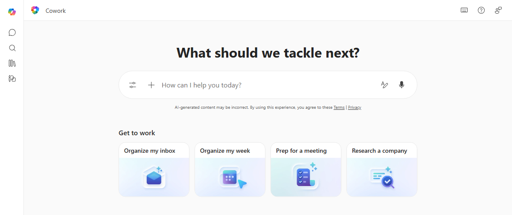
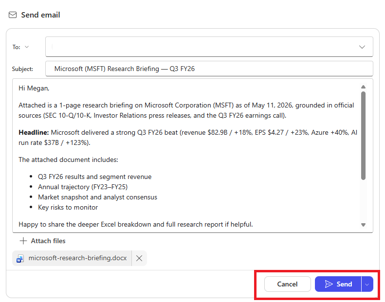
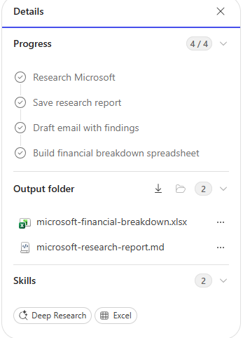
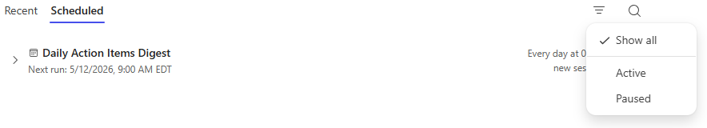

::: zone pivot="Video"
 
[!VIDEO https://learn-video.azurefd.net/vod/player?id=e6dd5653-af63-446b-b626-34ec901644dd]
 
::: zone-end
 
::: zone pivot="Text"

When you give Cowork a goal, the interaction usually follows a consistent rhythm. Understanding how it works helps you know where you stay in control and how to guide it toward better results.

## You describe your goal

Start a Cowork conversation from the Cowork home page in Microsoft Copilot. Type a request in the chat input, select one of the suggested prompts (such as *Catch me up*, *Organize my inbox*, or *Prep for a meeting*), or use voice input. To add files, drag them into the chat or select from OneDrive, SharePoint, or Teams.

The more specific the request, the better the results. A request like *"Send an email to the marketing team summarizing last week's campaign results and format the summary as a PDF"* gives Cowork much more to work with than *"send an email."*

## Cowork plans and starts working

After you send your request, Cowork breaks it into steps and begins working through them. As it progresses, updates appear in the conversation that show what it's doing before the final response is ready.

Cowork draws on [Work IQ](/microsoft-365/copilot/extensibility/work-iq), the intelligence layer behind Microsoft Copilot, to understand your work context. Work IQ connects data from your emails, meetings, files, chats, and calendar with contextual signals like collaboration patterns and activity history. This means it doesn't just search for files you point it at. It reasons across your work environment to find what's relevant, while respecting your organization's permissions and security boundaries.

Depending on the task, these updates may include:

- **Thinking indicator** - Cowork is processing your request and determining how to approach the work.
- **Skill messages** - It loads the skills it needs for the task, such as preparing to create a document, compose a message, research information, or manage calendar-related work.
- **Step-by-step updates** - It shows actions as it works, such as searching for information, reviewing sources, creating files, or preparing outputs.
- **Streaming response** - The response appears as it is generated, so you can follow along without waiting for the full result.
- **Interactive cards** - Some results appear as interactive cards with structured layouts and data displays directly in the conversation.

### Skills

As Cowork works through your request, it loads specialized skills, which are built-in capabilities that help it complete parts of the task. When a skill is loaded, a message such as *"Preparing to compose emails"* appears in the conversation, and active skills show up in the side panel.

Some skills include:

- **Word** - Create and edit Word documents.
- **Excel** - Create and edit Excel spreadsheets.
- **PowerPoint** - Create and edit PowerPoint presentations.
- **PDF** - Work with PDF documents.
- **Email** - Compose, reply, forward, and send emails. Save drafts and manage attachments.
- **Scheduling** - Schedule meetings.
- **Calendar Management** - Create events using natural language, add Teams meeting links, and manage your calendar.

The skills Cowork uses depend on your request, your available Microsoft 365 context, and the capabilities enabled in your environment. For the full list, see [Cowork Skills](/microsoft-365/copilot/cowork/use-cowork#cowork-skills).

## You approve actions before they happen

This is the part of Cowork that matters most for trust: **it asks for your permission before taking sensitive actions on your behalf.** Actions like sending an email, posting a Teams message, scheduling a meeting, or sharing a document typically pause for approval before they happen.

When an approval is required, a dialog appears with a preview of what Cowork plans to do. For actions like sending an email or posting a message, the dialog shows the full content so you can review it before approving.

Your choices for each approval:

- **Approve the action** - The button matches the action Cowork is about to take, like the Send button shown above. Selecting it allows the action to proceed this one time.
- **Always allow** - Use the dropdown next to the approve button to allow the action and skip the prompt for similar actions in the rest of the conversation.
- **Cancel** - Stops the action. Cowork skips it and continues with the rest of your request.

> **IMPORTANT**: Always review the details before approving. Check that recipients, content, and other details are correct. Cowork shows you what it plans to do—take the time to verify it.

## You stay in control throughout

You don't have to watch while Cowork works—but you can step in anytime:

- **Pause** - It finishes its current step and then pauses. Interrupt to pause immediately, even mid-step.
- **Resume** - Continue from where it stopped.
- **Cancel** - Stop the current task entirely. Send a new message without resuming.

You can also send a new message while Cowork is still working. The message is queued and processed in order. If it changes the direction of the task, Cowork adjusts its approach.

## You review the results

When Cowork finishes, or as it produces outputs along the way, files it created appear in the **Details** pane on the right. The Details pane gives you a clear view of:

- **Progress** - A progress bar with the percentage of tasks complete, plus a step-by-step log.
- **Output folder** - Files Cowork created, each with **Download** and **Preview** options.
- **Input folder** - Files you provided as context.
- **Skills** - Which skills Cowork loaded during the conversation.

    

Many file types preview directly in the side panel—Word, Excel, PowerPoint, PDF, Markdown, images, and code files—without downloading first. Previews also expand to full screen or open in their native application.

Files that Cowork creates are saved to your **OneDrive**, where they're accessible at any time and protected by your organization's existing governance policies.

> **TIP**: When Cowork produces multiple output files, select **Download all files** at the top of the output file list to download everything as a single zip archive.

## Return to previous Cowork tasks

Cowork tracks each conversation as a task you can return to. Select the **Tasks** view to see your work across two tabs:

- **Recent** - Shows your tasks in chronological order, with status and output files. Filter by **Needs input**, **In progress**, or **Complete**.

    

- **Scheduled** - Shows your scheduled prompts with next run time and frequency. Filter by **Active** or **Paused**.

    

Select any task to reopen its conversation and continue working.

## Putting it together

Most Cowork interactions follow a similar rhythm:

1. **You describe the goal** - Tell Cowork what you need done, with as much context as helpful.
2. **Cowork plans and works** - Cowork breaks the goal into steps, shows progress, and asks questions when needed.
3. **You approve sensitive actions** - Review and approve actions like sending messages, sharing files, or changing meetings.
4. **You review the results** - Download files, preview outputs, and provide feedback.

The key principle: **Cowork carries out the work; you make the decisions.** This holds whether the task takes a few minutes or longer.

::: zone-end

> **NOTE**: We recognize that different people like to learn in different ways. You can choose to complete this module in video-based format or you can read the content as text and images. The text contains greater detail than the videos, so in some cases you might want to refer to it as supplemental material to the video presentation.
