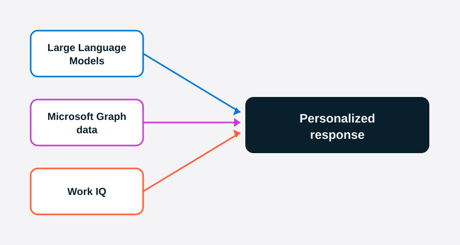

Microsoft Copilot is an AI-powered assistant integrated across Microsoft 365 apps that helps you draft content, summarize information, analyze data, and automate repetitive tasks. Available as an add-on license for Microsoft 365, Copilot brings generative AI directly into Word, Excel, PowerPoint, Outlook, Teams, and more—so intelligent assistance is available wherever you work.

## How Microsoft Copilot works

Microsoft Copilot combines three components to generate personalized, context-aware responses:

- **Large Language Models (LLMs)** — AI models that understand and generate human language, enabling Copilot to draft, summarize, and reason with natural language
- **Microsoft Graph** — your organizational data including emails, documents, calendars, chats, and meetings
- **Work IQ** — the intelligence layer that grounds Copilot in your work context, relationships, and patterns so responses align with how you and your organization actually work

**Work IQ** goes beyond searching your files. It builds an understanding of your role, your relationships, and your working patterns—so Copilot's responses reflect how you and your organization actually operate. For example, if you frequently collaborate with a colleague on quarterly reports, Work IQ helps Copilot surface their recent documents when you ask for project context, without you having to specify where to look. It's also aware of signals like your job title, the teams you work with, and the types of content you create, which is why responses in work mode feel tailored to you rather than generic.

Copilot can also reason over content beyond Microsoft 365 when your organization sets up **Copilot connectors**. These connectors bring data from external systems—such as Salesforce, ServiceNow, or Jira—into Microsoft Graph, so Copilot can search, summarize, and answer questions using that content alongside your Microsoft 365 files and messages. For example, if your organization connects Salesforce, you could ask **What's the status of the Contoso deal?** And Copilot returns a summary with a link back to the source record. Connectors are configured by your administrator, so check with your IT team to find out which systems are available in your organization.

Together, these components allow Copilot to generate personalized responses and take actions directly within your workflow. Rather than searching through files or switching apps, you ask Copilot in natural language and get results grounded in your actual work.

## What this module covers

Imagine you're a business professional at a growing organization. You receive a request to prepare a quarterly performance summary, create a leadership presentation, and draft a market analysis report — all under a tight deadline.

In this module, you follow a realistic workflow — draft, refine, and share content — while learning how to guide Copilot with effective prompts across Word, PowerPoint, and Outlook. You also explore the Researcher agent, which reasons across your organization's knowledge and external content to deliver structured, cited reports. The module wraps up with an exercise where you can apply these skills in a realistic scenario.

By the end of this module, you're able to:

- Describe the key features and benefits of Microsoft Copilot in Word, Outlook, and PowerPoint.
- Use Microsoft Copilot to draft, refine, and enhance documents, emails, and presentations.
- Use the Researcher agent to gain deeper insights to your questions.
