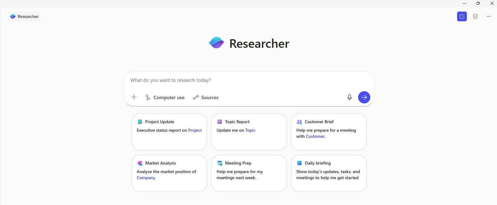

::: zone pivot="Video"

[!VIDEO https://learn-video.azurefd.net/vod/player?id=2e6136ed-60ed-49a0-8f7a-9bf7cff2e638]

::: zone-end

::: zone pivot="Text"

With your Q3 performance report drafted and your leadership presentation ready, your manager has one more request: a market analysis that includes external research — industry trends, competitor moves, and benchmarks that aren’t in your organization's files. The Researcher agent is built exactly for this kind of task.

## What is the Researcher agent?

The Researcher agent is your intelligent assistant built into Microsoft Copilot. Think of it as a supercharged research partner that helps you gather, analyze, and summarize information—whether from the web, your work documents, or both. Researcher delivers a structured, easy-to-read report tailored to your question to help you make better decisions faster.

You can access Researcher in two ways:

- **From the Word Copilot pane**: Select **+** in the prompt box and choose **Researcher** from the menu — no need to leave your document.
- **From the Microsoft Copilot app**: Open [https://copilot.cloud.microsoft.com](https://copilot.cloud.microsoft.com) and select **Researcher** from the left navigation pane or the agent list.

It's designed to help you:

- Conduct multi-step research using both internal work content and public web sources.
- Deliver structured reports with organized headings, citations, and visual formatting.
- Ask clarifying questions to refine your request—just like a human colleague might.
- Generate content that's ready to use in Word, PowerPoint, or Outlook.

Unlike standard Copilot, which focuses on drafting and editing, the Researcher agent is optimized for discovery, synthesis, and insight generation.

## Working with the Researcher agent

You start by selecting **Researcher** from the agent list, then describe what you need to understand or research. The agent may ask clarifying questions to refine its approach before conducting multi-step research across your internal files and the web. It then returns a structured report with organized sections, citations, and links to source material — ready to review and iterate on.

The more specific your prompt, the more targeted the output. Including context about your role, what the research is for, and the format you need produces the best results:

- **I'm preparing a market analysis for a retail leadership team. Research the latest AI trends in retail, including competitor activity and consumer adoption rates, and draft a structured report.**
- **Summarize the key challenges and opportunities facing retail businesses entering the AI space, based on recent industry sources.**

Once you have an initial report, follow-up prompts let you dig deeper or shift focus:

- **Include insights on consumer behavior and adoption rates.**
- **Summarize key moves by top competitors in the last 12 months.**
- **Highlight any risks or challenges in the market.**

You can also shape the same research for different audiences without re-running the query:

- **Summarize these findings into three bullet points for a leadership slide.**
- **Write an executive summary for this report.**
- **Draft an email update summarizing these insights for the team.**

This iterative approach — research, refine, reformat — is what makes the Researcher agent well suited to tasks where the same insights need to reach different stakeholders in different formats.
::: zone-end
 
> **NOTE**: We recognize that different people like to learn in different ways. You can choose to complete this module in video-based format or you can read the content as text and images. The text contains greater detail than the videos, so in some cases you might want to refer to it as supplemental material to the video presentation.
