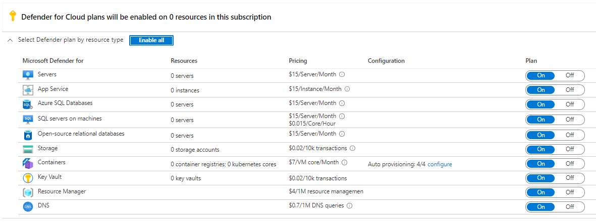

## What is Microsoft Defender for Cloud?

Microsoft Defender for Cloud's features covers the two broad pillars of cloud security:

**Cloud Security Posture Management (CSPM)** - In Defender for Cloud, the posture management features provide:

- Visibility - to help you understand your current security situation
- Hardening guidance - to help you efficiently and effectively improve your security
The central feature in Defender for Cloud that enables you to achieve those goals is secure score. Defender for Cloud continually assesses your resources, subscriptions, and organization for security issues. It then aggregates all the findings into a single score so that you can tell, at a glance, your current security situation: the higher the score, the lower the identified risk level.

**Cloud Workload Protection (CWP)** - Defender for Cloud offers security alerts that are powered by Microsoft Threat Intelligence. It also includes a range of advanced, intelligent, protections for your workloads. The workload protections are provided through Microsoft Defender enhanced security features plans specific to the types of resources in your subscriptions. For example, you can enable Microsoft Defender for Storage to get alerted about suspicious activities related to your Azure Storage accounts.

The Defender for Cloud provides visibility and control of the CWP features for your environment:

