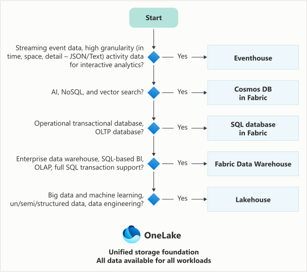

Microsoft Fabric provides three primary analytical data stores: the lakehouse, the warehouse, and the eventhouse. Each store is built on OneLake and uses an open data format, but they serve different purposes and support different workload patterns. Understanding the strengths and trade-offs of each store helps you match data characteristics and team skills to the right solution.

In the retail scenario, you need to evaluate all three options before making a recommendation for each business group. This unit introduces the three stores, compares their core characteristics, and describes the decision factors you use throughout the rest of this module.

## Three analytical data stores

All three analytical data stores in Fabric share a common foundation. They store data in OneLake, support open formats like Delta and Parquet, and integrate with other Fabric workloads. However, they differ in their primary query language, write capabilities, and the types of data they handle best.

= **Lakehouse**: Flexible analytics and data engineering

- **Warehouse**: Structured analytics and BI reporting
- **Eventhouse**: Real-time analytics

Each store is designed for a specific set of workload patterns, and no single store is ideal for every scenario. Many real-world solutions use multiple stores together, with each one handling the data pattern it's best suited for.

> Note: Fabric also includes SQL database in Fabric for operational transactional workloads and Cosmos DB in Fabric for AI, NoSQL, and vector search scenarios. These stores serve operational purposes rather than analytical ones. This module focuses on the three analytical data stores: lakehouse, warehouse, and eventhouse.

## How data stores connect through OneLake

Because all three stores write data to OneLake, data doesn't need to be copied or moved between systems for cross-workload access. Fabric provides several integration points:

- Shortcuts let you reference data in one store from another without duplicating it. For example, a warehouse can create a shortcut to Delta tables managed by a lakehouse.
- Cross-database queries in the warehouse let you join data from multiple warehouses and lakehouse SQL analytics endpoints using three-part naming.
- The SQL analytics endpoint on a lakehouse automatically exposes Delta tables for T-SQL queries and Power BI Direct Lake connections.

This shared OneLake foundation means your choice of data store doesn't lock you into a single access pattern. You choose the store that best handles data ingestion and transformation for a given workload, and other teams can access that data through the method that suits them.

## Decision factors

The following diagram shows the ideal use cases for each data store in Fabric.

