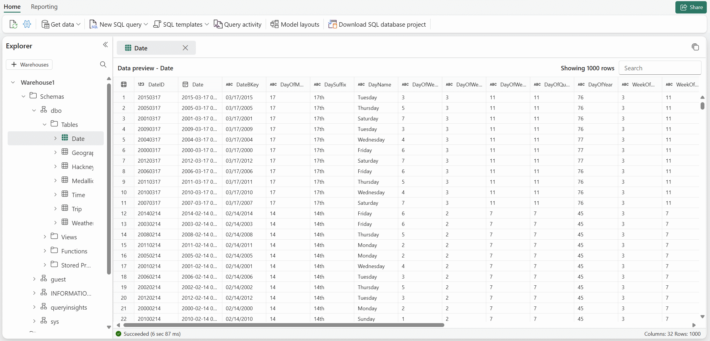

A warehouse in Microsoft Fabric is an enterprise-scale relational data store built on a data lake foundation. It provides a full T-SQL experience for creating, loading, and querying structured data with multi-table ACID transaction support. If your team works primarily with SQL and you need transactional write capabilities, the warehouse is designed for that workload.

In the retail scenario, the sales team wants structured reporting with complex joins and frequent dimension updates. The warehouse is the primary candidate for this use case. This unit examines the warehouse's capabilities so you can evaluate when it's the right choice.

Warehouse architecture and capabilities
The Fabric warehouse stores all data in Delta format on OneLake, just like the lakehouse. However, the warehouse provides a fundamentally different development experience. You interact with the warehouse through T-SQL, using familiar SQL Server patterns for table creation, data loading, and query optimization.

The warehouse supports:

- Full DML operations including INSERT, UPDATE, DELETE, and MERGE. You can modify data in place, which is essential for maintaining slowly changing dimensions and handling corrections.
- Full DDL operations including CREATE TABLE, ALTER TABLE, views, stored procedures, and functions. You define your schema with the same T-SQL statements you use in SQL Server.
- Multi-table ACID transactions. Changes across multiple tables commit or roll back together, which is critical for maintaining referential integrity in dimensional models.
- Cross-database queries. You can join data from multiple warehouses and lakehouse SQL analytics endpoints using three-part naming, without moving or copying data.
