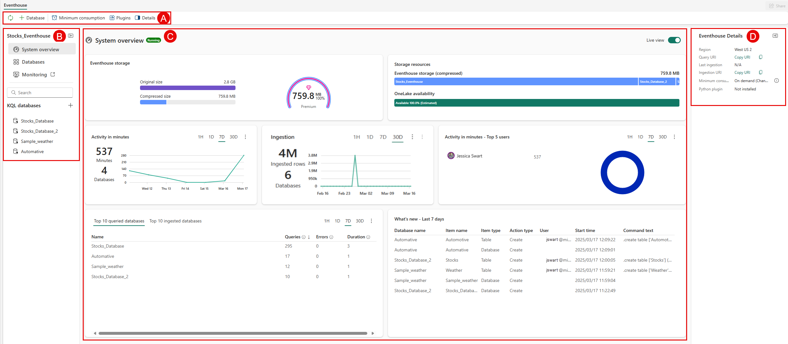

An eventhouse in Microsoft Fabric is designed for real-time analytics on streaming and time-series data. It efficiently handles large volumes of events arriving continuously, and it provides fast query performance on data with a natural time component. If your workload involves telemetry, logs, IoT data, or any event-based pattern, the eventhouse is purpose-built for that scenario.

In the retail scenario, the operations team monitors IoT sensor data from distribution centers in real time. They need dashboards that show temperature trends and anomaly alerts with minimal latency. The eventhouse is the right store for this workload. This unit examines the eventhouse's capabilities and helps you evaluate when to choose it.

Eventhouse architecture and capabilities
An eventhouse is a workspace of KQL databases that share capacity and resources. Each KQL database stores event-based data that's automatically indexed and partitioned by ingestion time. This time-based partitioning is fundamental to how the eventhouse achieves fast query performance on large volumes of event data.

The eventhouse accepts data from multiple sources and pipelines, including Eventstream, SDKs, Kafka, Logstash, dataflows, and more. Data arrives in various formats and is ingested in near real-time. Unlike the lakehouse and warehouse, the eventhouse is optimized for append-heavy workloads where new events stream in continuously and existing data is rarely modified.

The primary query language for the eventhouse is Kusto Query Language (KQL). KQL is designed specifically for time-series analysis and provides built-in operators for aggregations over time windows, anomaly detection, pattern matching, and geospatial analysis. The eventhouse also supports a subset of T-SQL for teams that prefer SQL syntax, though KQL provides the richest analytics experience.

## When to choose an eventhouse

The eventhouse is the right choice when your scenario matches several of these characteristics:

- IoT telemetry and sensor data. You ingest data from equipment, sensors, or devices that generate continuous streams of measurements. The eventhouse's streaming ingestion and time-based partitioning handle this pattern efficiently.
- Log and event analytics. You collect application logs, security events, or system metrics that need to be searchable and analyzable in near real-time. KQL's full-text search and pattern-matching operators are designed for this type of data.
- Real-time dashboards and monitoring. You need dashboards that refresh frequently and show current state alongside historical trends. The eventhouse's fast query engine and Power BI integration support low-latency visualizations.
- Time-series analysis. You analyze trends, seasonality, or anomalies in data with a natural time dimension. KQL provides built-in time-series functions like make-series, series_decompose, and series_decompose_anomalies.
- High-volume ingestion. You receive millions of events per day and need them to be queryable within seconds. The eventhouse is optimized for high-throughput ingestion with automatic scaling.
