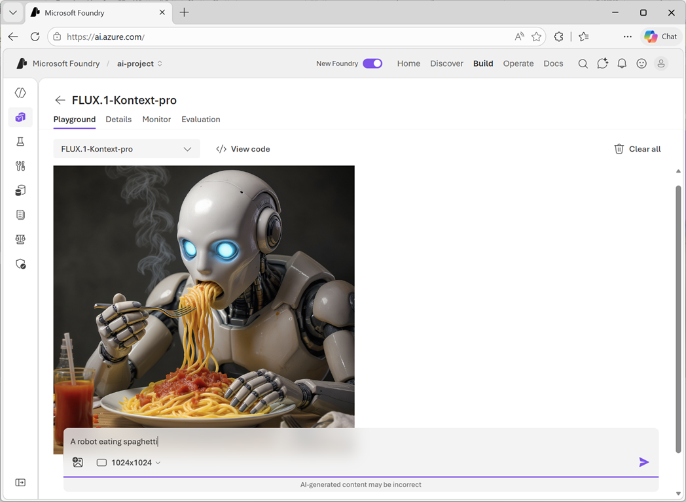

::: zone pivot="Video"

[!VIDEO https://learn-video.azurefd.net/vod/player?id=d769daee-3c79-472c-ab77-ab8b5c901c29]

> **TIP**: See the **Text** tab for more details!

::: zone-end

::: zone pivot="Text"

To experiment with image generation models, you can create a Microsoft Foundry project and use the *model playground* in Microsoft Foundry portal to submit prompts and view the resulting generated images.

When using the playground (subject to model support), you can specify the resolution (size) of the generated images and include a reference image for the model to base it's output on.

::: zone-end
