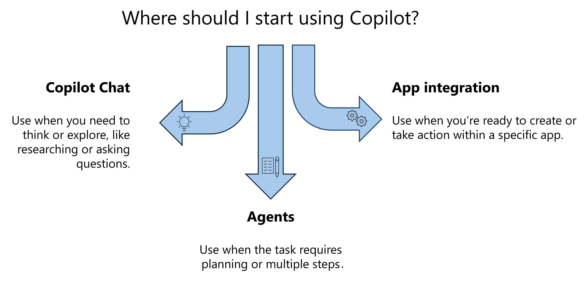

Microsoft Copilot is an AI assistant embedded in the apps you already use, including Word, PowerPoint, Excel, Teams, Outlook, and Copilot Chat. It works alongside you as you draft content, analyze data, summarize information, and manage tasks throughout your workday.

What sets Copilot apart from general-purpose AI tools is how it uses your organizational data. While public AI tools rely on broadly available information, Copilot combines its trained knowledge with the emails, meetings, chats, and files you already have access to. This produces responses that reflect your actual work context, not just generic outputs.

This capability is powered by Work IQ.

How Work IQ grounds your Copilot experience
Work IQ helps Copilot understand your work in context. It connects your emails, files, meetings, and conversations, allowing Copilot to identify relationships between them and surface what's most relevant.

Instead of relying on exact keyword matches, Copilot understands meaning. For example, if you ask about "budget concerns for the product launch," it may surface a document titled "Q3 Revenue Risk Analysis" because it recognizes the connection between those topics.


You don't need to remember specific file names or search terms. You can ask in plain language and still get relevant results.

Copilot also reflects your work patterns over time, considering the projects you're involved in and the people you collaborate with most often.

One important boundary: Copilot only accesses content you already have permission to view. It never expands your access to other data.

Go beyond your organizational data with web-grounded responses
Not every question can be answered using internal data alone. You may need current market trends, industry benchmarks, or external research.

Copilot can use both your organizational data and the public web, depending on your request.

Ask about a recent meeting → Copilot uses your work data
Ask about industry trends → Copilot uses web data
Ask how your company compares to industry benchmarks → Copilot can combine both
This allows you to gather internal and external insights in a single response, without switching between tools.

## Extend Copilot with agents

Copilot can go beyond single prompts. Agents are specialized assistants designed to help with more complex or multi-step work.

Instead of manually gathering information and structuring prompts, you can use agents tailored to specific tasks.

For example:

- Use Researcher to explore a topic across multiple sources
- Use Analyst to compare and analyze data across files
- Use Idea Coach to plan a presentation
- Use Writing Coach to refine tone and clarity
- Agents help you structure your approach, work across multiple inputs, and complete tasks more efficiently.

## Where Copilot appears in your apps

You use Copilot in different ways depending on the app, but the core experience stays consistent.

In Word, PowerPoint, and Excel, Copilot appears directly in your workspace so you can work alongside your content.
In Outlook and Teams, Copilot appears in a side pane, giving you a chat experience alongside your messages and meetings.
Copilot Chat is the broader, cross‑app experience. You find it in the Microsoft Copilot app, and in Outlook and Teams. It's where you can ask questions across your work data or the web, create content, and use agents to complete more complex tasks.
Once you learn how to work with Copilot in one place, the same patterns carry across the others.

Because Copilot works across multiple experiences, knowing where to start can make your workflows more efficient.

## Choose the best place to start

Copilot works across chat, apps, and agents. The best place to start depends on what you're trying to do. Use this quick guide to choose the right starting point.



## Start in Copilot Chat when you need to think or explore

Use Chat when you're:

- Researching a topic
- Comparing information across files or sources
- Asking questions about emails, meetings, or documents
- Figuring out what to do next

### Example

```
Summarize the key risks from last week's client meeting.
```

Chat helps you gather context before you create or act.

## Start in an app when you're ready to create or take action

Use apps like Word, PowerPoint, Excel, or Outlook when you:

- Have a clear goal
- Want to create or edit something directly

### Examples

- Draft a client email in Outlook
- Build a presentation in PowerPoint
- Analyze data in Excel
- Apps help you move from idea to output.

## Use agents when the task requires planning or multiple steps

Use agents when you need help:

- Structuring your approach
- Working across multiple sources
- Managing multi-step workflows

### Examples

- Use Idea Coach to plan a presentation
- Use Analyst to compare multiple datasets
- Use Facilitator to manage a meeting
- Agents help you organize and guide your work.

## A simple way to think about it

- Exploring or researching? → Start in Chat
- Creating something? → Start in an app
- Planning or analyzing? → Use an agent

With this approach, you can quickly choose where to start and use Copilot more effectively as you move through your work.
