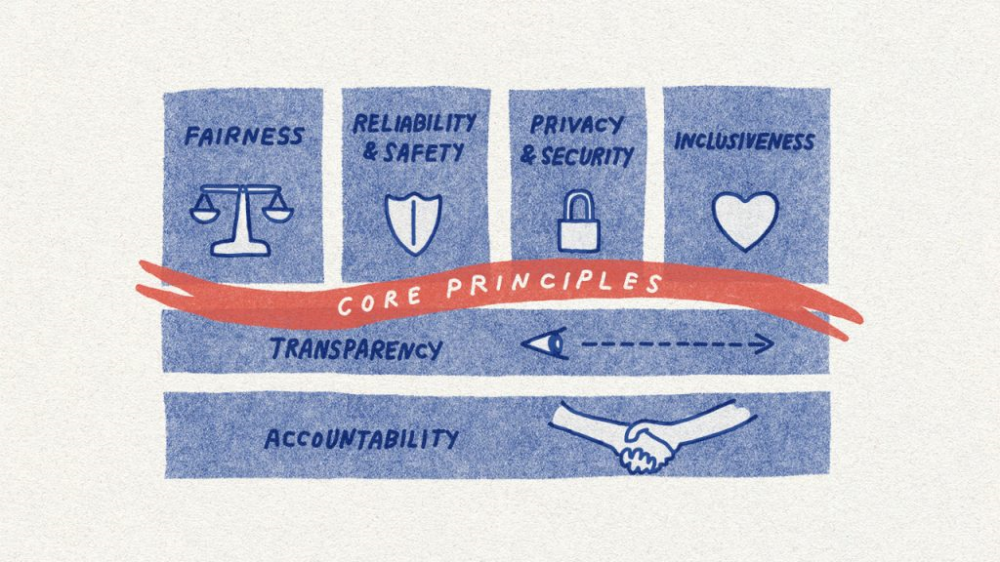

Using Copilot with real work content—client proposals, financial models, or confidential meeting notes—naturally raises a question: who can see what Copilot does with that data?

The answer is straightforward. Microsoft Copilot is built on the same security and compliance foundation as the rest of Microsoft 365. It follows clear contractual and technical commitments that define how your data is handled. Understanding these commitments helps you use Copilot confidently, even with sensitive information.

## Enterprise Data Protection

Enterprise Data Protection (EDP) defines how your data is handled when you use Microsoft Copilot and Copilot Chat under Microsoft's Product Terms and Data Protection Addendum.

The most important point: your prompts, responses, and the data Copilot accesses are not used to train Microsoft's foundation AI models.

What you type into Copilot, and what it generates for you, stays within your organization's boundary. It isn't used to improve or train models for other customers.

That means when you draft a confidential proposal or summarize an internal financial review, that content stays within your environment.

## Sensitivity labels and encryption

Copilot works with Microsoft Purview sensitivity labels to enforce your organization's data protection policies, even during AI-assisted work.

If a document has a sensitivity label, Copilot respects it. If that label restricts access or applies encryption, those same restrictions still apply. A user without the right permissions can't use Copilot to summarize or reference that content.

When Copilot generates new content based on labeled sources, it carries forward the highest-priority sensitivity label. For example, if you create a draft using confidential files, the new content is treated as confidential as well.

Your information protection policies don't stop at files. They extend into how Copilot helps you work with that content.

## How Copilot respects your access and data boundaries

Copilot operates within your organization's Microsoft 365 environment. Your data is logically isolated from other organizations, and communication is encrypted.

It also follows the same access controls you already work with. Copilot only uses and surfaces content that the current user has permission to access. It doesn't expand access or expose restricted information.

If you can't open a file, Copilot can't use it either.

## Microsoft's approach to responsible AI

These data protections are part of a broader approach to responsible AI. Microsoft's principles, including fairness, reliability and safety, privacy and security, inclusiveness, transparency, and accountability, guide how Copilot is built and maintained.

In practice, this includes safeguards like content filtering, prompt injection detection, and ongoing testing against ethical standards. These are built into the system, not added on later.

When you use Microsoft Copilot, you're working with a tool designed to support both productivity and trust.
