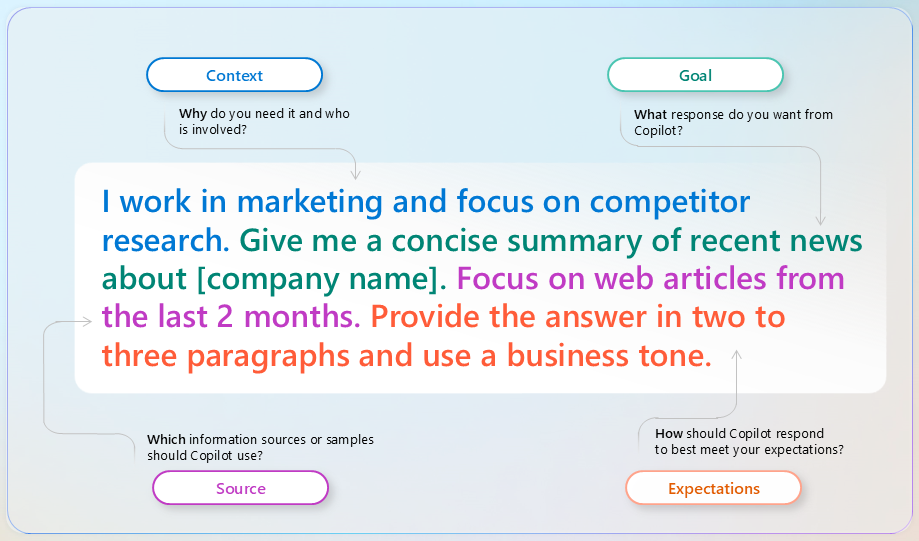

Prompts are how you communicate with Copilot, telling it what you need across Microsoft 365 apps such as Word, PowerPoint, Teams, Excel, and Outlook. Think of prompting as a conversation with a knowledgeable assistant—the clearer and more specific you are, the better the response you get.

## Include the right prompt elements

An effective prompt significantly improves Copilot's output, ensuring accurate and contextually relevant responses. To get the best response, focus on four key elements when writing your prompts: context, goal, source, and expectations.

- Provide context: Why do you need it, and who's involved? Describe the situation—whether you're preparing for a client meeting, analyzing a quarterly report, or building an executive presentation. Unlike traditional search, Copilot responds best to detailed, descriptive prompts.

- Describe a goal: What do you want Copilot to do? Specify the output—a summary, a first draft, a list of action items, a data visualization. If you have a format in mind, describe it.

- Define a source: Where should Copilot look? Reference specific files, emails, meetings, or meeting notes so Copilot pulls from the right content. With your Microsoft 365 Copilot license, you can reference your work data—emails, meetings, and files—directly in your prompts.

- Set expectations: How should Copilot respond? Specify the audience, tone, length, or structure. A response for senior leadership reads differently than one for a project team update.

The following diagram shows these four elements in a complete example prompt:

A clear goal is the foundation of any prompt, but adding context, source, and expectations makes Copilot's responses more accurate and more useful. The way you structure your prompt determines the quality of what you get back.

## Prompt and iterate

Crafting a strong first prompt matters, but the real power of Copilot often comes through iteration. Instead of accepting the first response, refine it with follow-up prompts. If Copilot misses a detail you wanted, send a follow-up. If the tone isn't right, ask it to adjust. Copilot works best as a back-and-forth conversation, not a one-shot transaction.

> Tip: Once Copilot generates a response, select the sources to see where the content came from. AI-generated content can be inaccurate, so reviewing sources before sharing or publishing is a good habit.
