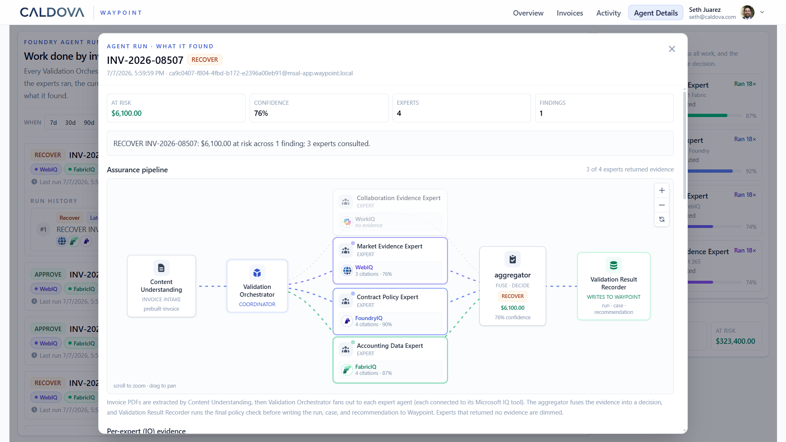

## Introduction to Caldova

Caldova is a fictional company created by Microsoft to demonstrate AI-native enterprise software patterns in a realistic pharmaceutical operations setting. In that story, Caldova operates globally across the pharmaceutical lifecycle: research and development, manufacturing, production, commercialization, and market access. Its ambition is to accelerate innovation, lower cost, and improve outcomes at scale.

The company is built around a simple operating philosophy: AI must do more than make work more efficient. It must make the organization extraordinary. That means AI is not treated as a separate tool. It shows up inside the flow of work: creating artifacts, analyzing signals, coordinating action, and automating trusted tasks.

[Caldova Waypoint](https://github.com/caldova/waypoint){:target="_blank"} is the reference application for invoice assurance in contract manufacturing. It demonstrates how an enterprise system can combine business records, governed agent workflows, evaluation, optimization, deployment automation, and a production-style application surface.

Waypoint is Caldova's governed boundary for supplier invoice review, evidence investigation, findings, cases, approved actions, audit, and approvals. Agents assist with evidence gathering and recommendations while the application keeps decisions, writes, and trust controls inside the system of record.
