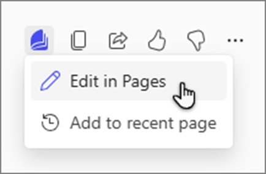
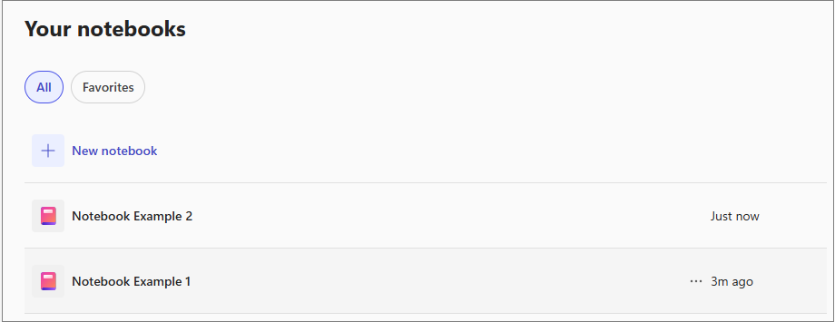

With your meeting recap and follow-up covered, the next step is giving the team a shared place to organize the project's decisions, resources, and ongoing work. In this unit, you'll explore how Copilot Pages and Copilot Notebooks help you centralize project content and collaborate asynchronously — so decisions don't get buried in email threads.

## Build a shared project hub with Copilot Pages

Copilot Pages gives your team a shared, editable canvas that lives inside Microsoft Copilot. Rather than keeping project decisions in a chat thread or email, you can turn any Copilot response into a Page and expand it into a full collaboration hub — with sections for objectives, milestones, stakeholder roles, and open questions.

To create a Page, select **•••** underneath any Copilot response and choose **Edit in Pages**. The content copies into a new page you can continue editing with Copilot or directly. From there, you can prompt Copilot to expand it:

- **Turn this into a collaborative LaunchPad project hub with sections for objectives, key milestones with a timeline, stakeholder roles and responsibilities, and a space for open questions or risks.**

Your Pages are saved indefinitely and accessible from the **Pages** tab in the Microsoft Copilot app, Teams, and Outlook — making them a persistent, shared reference point for your team across the entire project lifecycle.

## Centralize project knowledge with Copilot Notebooks

Copilot Notebooks is your smart workspace inside Microsoft 365 that brings all your project content — files, chats, meeting notes, and more — into one place for AI-powered analysis and collaboration.

### Access Copilot Notebooks

You can get to Copilot Notebooks two ways:

- **Microsoft Copilot app**: Sign in at [microsoft365.com/copilot](https://microsoft365.com/copilot) and select **Notebooks** from the left navigation pane.
- **OneNote**: Open OneNote on Windows desktop, the web at [onenote.cloud.microsoft](https://onenote.cloud.microsoft), iPhone, or iPad and select **Create Copilot Notebook** from the left pane.

### Add reference files

When you create a notebook, you name it and add references — the files and sources Copilot uses to ground its responses. From the **References** tab, select **Add reference** and choose from:

- **Suggested files** — Copilot recommends files based on your recent activity.
- **Search** — Find a specific file by name.
- **Upload** — Add files directly from your device.
- **Attach cloud files** — Browse OneDrive.
- **Link** — Add a URL to a supported file within your Microsoft 365 account.

Supported file types include Word, Excel, PowerPoint, PDFs, images, text and code files, SharePoint/OneDrive links, Teams chats, emails, OneNote text pages, and past Copilot Chat conversations. Only the first 100 references in a notebook are used for grounding.

### Provide custom instructions

You can guide how Copilot responds across your entire notebook by setting custom instructions. Open your notebook, select **Add Copilot instructions**, enter your preferences — tone, formatting, language, focus area — and select **Save**. For example:

**Always respond in bullet points, use a professional tone, and prioritize action items over background context.**

Your instructions appear under the notebook title and can be edited at any time.

### Ask questions about your notebook content

Once references are added, use the chat box to ask Copilot questions grounded in those files:

- **Summarize the current blockers and next steps for the LaunchPad project based on these references.**
- **What are the main decisions or action items from these meeting notes?**
- **What risks or blockers are mentioned across these documents?**
- **Give me a one-paragraph brief I can share with stakeholders.**

Copilot's responses are grounded specifically in your notebook's references — not general knowledge — making answers directly relevant to your project.

### Share your notebook

Notebooks aren't just for solo work. Select **Share** from the toolbar, enter names or email addresses, choose an access level (view or edit), and select **Send**. Shared members can add references, ask Copilot questions, and build on each other's outputs in real time — well suited for team projects where everyone needs the same grounded context.

### Generate an audio overview

Copilot can transform your notebook's content into a spoken audio summary. Select **Get audio overview**, describe what you want — for example: **Create a 90-second summary focused on key action items in a confident, conversational tone** — then select **Generate audio**. Once ready, the overview plays automatically and you can adjust playback speed, skip forward or backward, save to OneDrive, or regenerate after adding more references.

> **NOTE**: Audio overviews support Word, PowerPoint, Pages, OneNote, and PDF files. Other file types are not included in audio generation.

### Export notebook content

When your notebook contains enough research, notes, or analysis, you can generate a Word document or Excel spreadsheet directly from it — no manual copying needed. Select **Create** from within the notebook and choose **Document** or **Spreadsheet**. Copilot generates the file grounded in your notebook's references and opens it for review and editing in Word or Excel.
